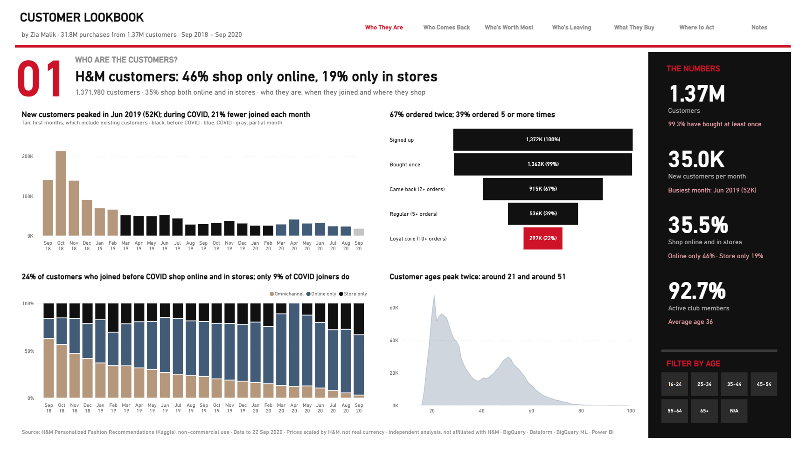
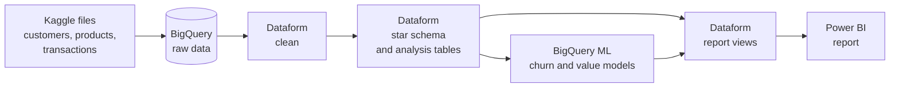
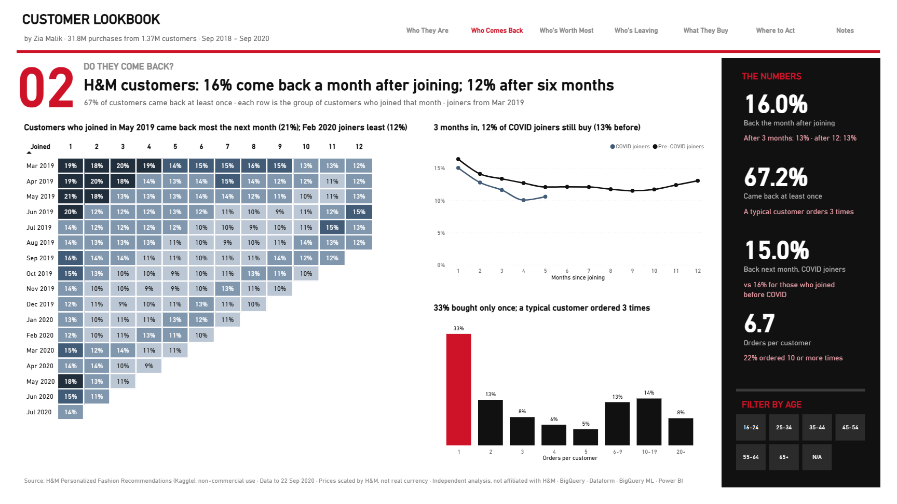
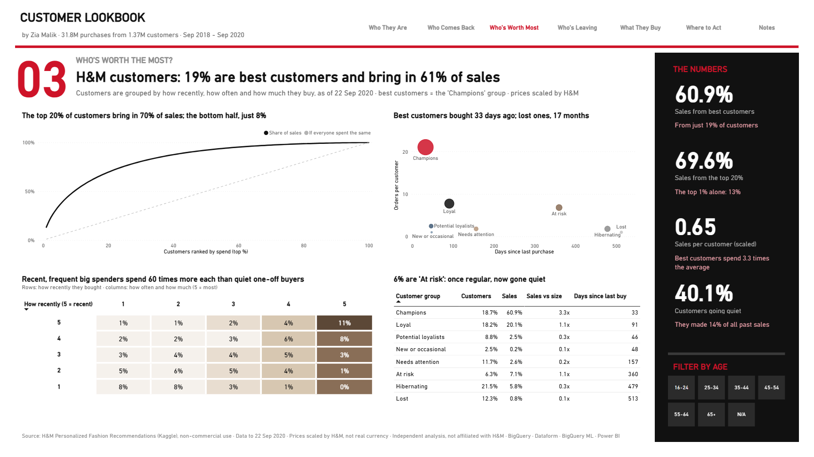
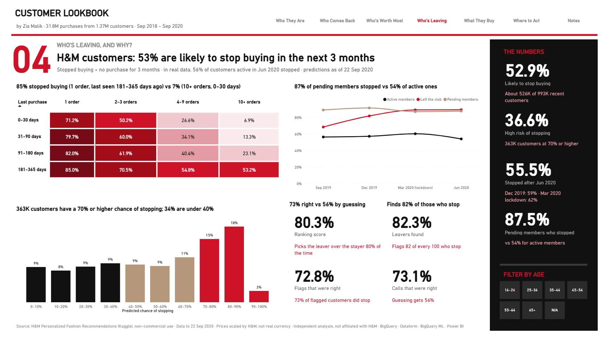
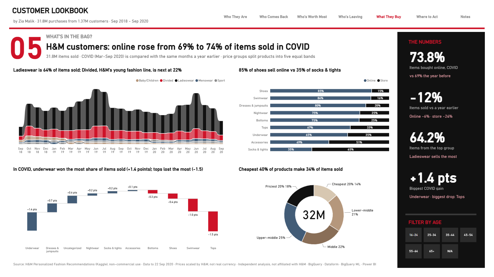
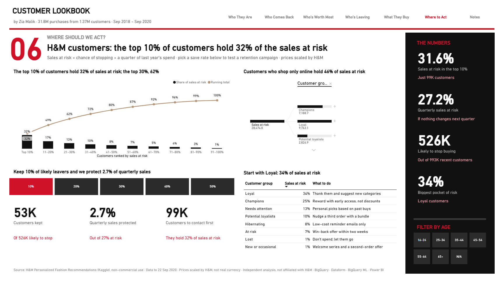

# Customer Lookbook: Who Buys, Who Stays and Who's Leaving at H&M

I built this project to answer the questions a retailer asks about its customers: who they are, whether they come back, who is worth the most, who is about to stop buying, what they buy, and where a retention budget should go first.

I used two years of real H&M purchase data and built the full pipeline myself on Google Cloud, from raw files to two prediction models and a finished Power BI report.

`BigQuery` · `Dataform` · `BigQuery ML` · `Power BI` · `SQL` · `DAX` · `Claude (AI-assisted development)`

**[▶ Open the live report](https://app.powerbi.com/view?r=eyJrIjoiNTM2ZjJiMWMtZjQwMy00NDgwLTg0ZjQtN2NiOWNkNTM4ZGJiIiwidCI6ImEyYjYxNTdiLWZlM2ItNGRlZi05OTAzLTc4YTRlMmU5NTNhYiJ9)** · [Download the PDF](report/hm_customer_lookbook.pdf)

---

## The project in numbers

| | |
|---|---|
| **Data** | H&M Personalized Fashion Recommendations (Kaggle): real club members, their purchases and the product catalog |
| **Size** | 31.8M items bought by 1.37M customers, across 105,542 products, September 2018 to September 2020 |
| **Storage** | Google BigQuery (free sandbox) |
| **Cleaning and modeling** | Dataform, rebuilt automatically on the 1st of every month |
| **Predictions** | BigQuery ML: who will stop buying, and how much they will spend |
| **Report** | 7 pages in Power BI, 207 DAX measures |

---

## What I found

- **Members lean online.** 46% shop only online and 19% only in stores. During COVID, online's share of items sold rose from 69% to 74%, while items bought in stores fell 24% on the same months a year earlier.
- **Getting a second order is the hard part.** 67% of customers came back for a second order and 39% ordered five or more times, but only 16% come back in the month after joining.
- **A small group drives sales.** The best customers (19% of buyers) bring in 61% of sales. The top 20% of spenders bring in 70%; the bottom half, just 8%.
- **About half are likely to stop buying.** My model expects 53% of last year's customers to make no purchase in the next 3 months. In real data, 56% of customers active in June 2020 did stop. Pending club members stopped far more often than active members (87% vs 54%).
- **Retention can be targeted.** The top 10% of customers by sales at risk hold 32% of it. Keeping just 20% of likely leavers would protect 5.4% of quarterly sales.
- **COVID changed the basket.** On the same months a year earlier, underwear gained the most share of items sold (+1.4 points) and tops lost the most (−1.5).

---

## How I built it

**BigQuery**
- I keep the raw files untouched in their own dataset, and all cleaned and modeled tables in a separate one.
- Everything runs on the free sandbox, so I managed its 10 GB storage limit and its 60-day table expiry with a small housekeeping step that runs as part of every build.
- Time travel is cut to 48 hours on every dataset, which keeps storage well under the limit.

**Dataform**
- **Step 1, clean:** one model per source file. I fix data types, map the sales channel to Store and Online, and turn placeholder values into proper blanks.
- **Step 2, model:** a star schema (customer, product, date and sales), plus tables for monthly activity, cohorts, customer groups and churn labels.
- **Step 3, predict:** the two BigQuery ML models train and score inside the same workflow, so the predictions are always rebuilt with the data.
- **Step 4, report views:** small views shaped for Power BI. They drop customer IDs, so the report only ever sees totals.
- Tests check every build for missing keys, duplicates, broken links between tables and values outside their allowed range.
- A scheduled workflow rebuilds everything at 3 AM Dubai time on the 1st of each month, running under its own service account.

---

## The report

| Page | The question it answers |
|---|---|
| **Who They Are** | Who are the customers, when did they join, and where do they shop? |
| **Who Comes Back** | How many come back, and did COVID joiners behave differently? |
| **Who's Worth Most** | Which customers bring in the sales? |
| **Who's Leaving** | Who is about to stop buying, and why? |
| **What They Buy** | What's in the bag, online vs in store, and what changed in COVID? |
| **Where to Act** | Where should a retention budget go first, and what could it protect? |
| **Notes** | How it was built, and how to read it |

Every headline, chart title and KPI line writes itself in DAX. When you pick an age group, the whole page updates, for example *"Customers aged 25-34: 53% are likely to stop buying in the next 3 months"*.

The **Where to Act** page includes a simple what-if simulator: pick a save rate (10% to 50%) and it shows how many customers that keeps and how much quarterly sales it protects.

---

## Problems I found in the data, and how I fixed them

| What was wrong | What it would have caused | What I did |
|---|---|---|
| The data starts in September 2018, so customers who first appear in the early months include people who had been shopping long before | Inflated return rates for the first cohorts | Labeled the first six months as warm-up and left them out of return-rate comparisons |
| The first way I split customers into groups put 30% in "Champions" and left the "Lost" and "New" groups empty | Groups that didn't describe real behavior | Switched to percentile ranks and tightened the Champions rule. Champions are now 19% of buyers and 61% of sales |
| Postal codes for many customers were the same long placeholder value | One fake "area" holding a large share of customers | Replaced the placeholder with a blank |
| The March 2020 lockdown changed buying behavior overnight | A churn model that learns from abnormal months | Kept the lockdown snapshot out of training and only reported on it |
| COVID months are spring and summer, while the months before include Christmas | Seasonal swings that look like COVID effects | Compared COVID months only with the same months a year earlier |
| The last month in the data is partial | A false drop at the end of every time chart | Flagged the partial month and left it out of trends |
| Prices are scaled by H&M, not real currency | Misleading money figures | Reported sales as shares and comparisons, never as currency |

---

## How I measure things

- **Stopped buying (churn)** means no purchase in the 3 months after a given date.
- **Came back** means bought again in a later month, counted from the month a customer first bought.
- **Best customers** are the "Champions" group: bought recently, often, and spent the most. Every buyer gets a 1–5 score for how recently, how often and how much they buy.
- **Sales at risk** is a customer's chance of stopping × a quarter of their spend over the past year.
- **Same season** compares March to September 2020 with the same months of 2019.

---

## The models

I built yearly snapshots of every active customer at four dates and labeled what they did in the next 3 months. The models learned from September and December 2019 and were tested on June 2020, which they had never seen.

| Model | What it predicts | Result on unseen data |
|---|---|---|
| **Churn model** (logistic regression) | Will this customer stop buying in the next 3 months? | Right 73% of the time vs 56% by guessing. Finds 82% of the customers who stop, and 73% of the customers it flags really do stop (ROC AUC 0.80) |
| **Value model** (linear regression) | How much will this customer spend in the next 3 months? | 27.5% smaller error than predicting the average (R² 0.36) |

The churn model is good at ranking customers by risk, which is what a retention campaign needs. The value model is a rough guide only, so the report uses past spend, not the forecast, to size sales at risk.

---

## What's next

**An AI analyst.** A small Streamlit app where Gemini answers plain-English questions about this data and writes a weekly insights brief. It will only ever see the table structure and aggregated results, never customer-level rows.

---

## What's in this repository

- `dataform/`: the Dataform project (sources, staging, marts, ML models, report views and tests)
- `powerbi/`: the Power BI project (PBIP). Every page, visual and DAX measure is saved as readable text
- `scripts/load_raw.ps1`: the one-time load of the Kaggle files into BigQuery
- `report/hm_customer_lookbook.pdf`: the full report, all 7 pages
- `images/`: report screenshots

The raw data, the Power BI data cache and .pbix files are not in this repository. The competition rules don't allow the data to be shared. You can explore the live report through the link at the top, or read the PDF.

---

*Data: H&M Personalized Fashion Recommendations, Kaggle, used for non-commercial purposes under the competition rules. This is my own independent analysis and is not linked to or approved by H&M.*

**Muhammad Zia Ul Haq** · Senior Data Analyst
